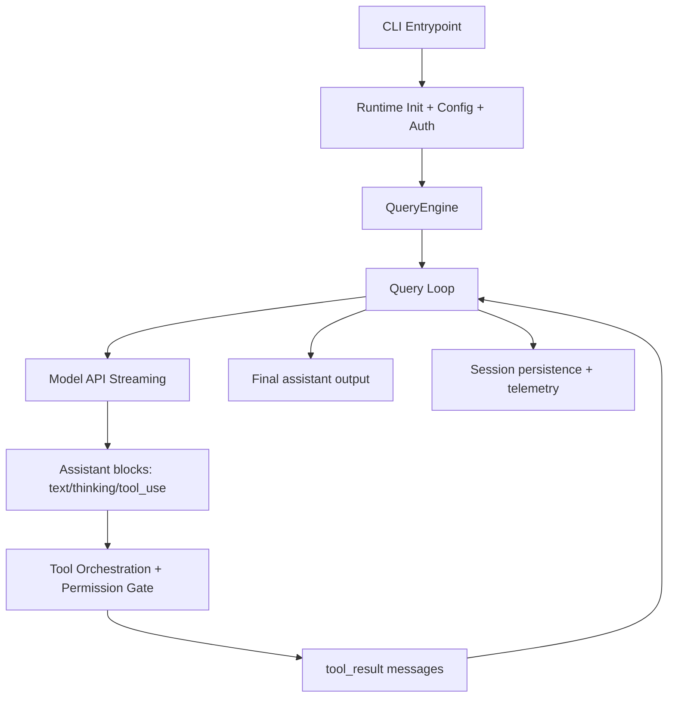

# LLM + Transformer Systems Study Guide (from Claude Code source)

## 0) The Most Important Truth First
This codebase is **not** the implementation of an LLM/Transformer itself.

It is an **LLM systems runtime**: a production-grade orchestration layer around a hosted model API.

So it teaches you a lot about:
- prompt engineering at system scale
- tool-use loops (agentic behavior)
- context-window management
- safety/permissions and policy controls
- streaming inference plumbing
- memory/session architecture

But it does **not** reveal model internals like:
- attention head design
- exact layer count / hidden dimension
- tokenizer implementation details
- training objective/data pipeline
- optimizer schedule or RLHF internals

---

## 1) Big-Picture Architecture
At a high level, the runtime is layered like this:

Core entry path:
- `/Users/maruyamayuto/Downloads/src/entrypoints/cli.tsx`
- `/Users/maruyamayuto/Downloads/src/main.tsx`
- `/Users/maruyamayuto/Downloads/src/entrypoints/init.ts`
- `/Users/maruyamayuto/Downloads/src/setup.ts`

Conversation engine:
- `/Users/maruyamayuto/Downloads/src/QueryEngine.ts`
- `/Users/maruyamayuto/Downloads/src/query.ts`

Model API adapter:
- `/Users/maruyamayuto/Downloads/src/services/api/claude.ts`
- `/Users/maruyamayuto/Downloads/src/services/api/client.ts`

---

## 2) End-to-End Turn Lifecycle

### Step A: Input enters QueryEngine
`QueryEngine.submitMessage()` is the control center.
It:
- builds system/user context
- processes user input (text, slash commands, attachments)
- calls the iterative query loop

Key file:
- `/Users/maruyamayuto/Downloads/src/QueryEngine.ts`

### Step B: Query loop calls model with streaming
`query.ts` runs a turn loop and repeatedly:
1. prepares normalized messages
2. calls `queryModelWithStreaming`
3. consumes streaming blocks
4. executes tools if requested
5. appends tool results
6. recurses until model reaches a terminal response

Key files:
- `/Users/maruyamayuto/Downloads/src/query.ts`
- `/Users/maruyamayuto/Downloads/src/query/deps.ts`
- `/Users/maruyamayuto/Downloads/src/query/config.ts`

### Step C: Stream protocol handling
The stream parser in `claude.ts` handles events like:
- `message_start`
- `content_block_start`
- `content_block_delta`
- `content_block_stop`
- `message_delta`

This means responses are assembled incrementally (token/block streaming), including thinking and tool-use deltas.

Key file:
- `/Users/maruyamayuto/Downloads/src/services/api/claude.ts`

### Step D: Tool calls and recursion
If assistant emits `tool_use` blocks, tool executors run them, produce `tool_result` blocks, and feed those back into the next model call.
This is the core agentic loop.

Key files:
- `/Users/maruyamayuto/Downloads/src/services/tools/toolOrchestration.ts`
- `/Users/maruyamayuto/Downloads/src/services/tools/toolExecution.ts`
- `/Users/maruyamayuto/Downloads/src/services/tools/StreamingToolExecutor.ts`

---

## 3) What This Tells You About LLM Runtime Design

## 3.1 Prompt construction is a first-class system
System prompt is assembled from:
- base behavioral policy
- tool instructions
- runtime context (date, git snapshot, CLAUDE.md/memory)
- optional custom append/override layers

Key files:
- `/Users/maruyamayuto/Downloads/src/constants/prompts.ts`
- `/Users/maruyamayuto/Downloads/src/context.ts`
- `/Users/maruyamayuto/Downloads/src/utils/queryContext.ts`

Takeaway:
A serious agent is mostly **prompt + protocol + tooling**, not just model call.

## 3.2 Inference parameters are dynamically managed
The runtime sets or adapts:
- model
- max output tokens
- thinking mode (`adaptive` vs budgeted thinking)
- effort values
- task budget
- temperature (with constraints)
- betas/capability headers

Key code concepts in `claude.ts`:
- `configureEffortParams`
- `configureTaskBudgetParams`
- adaptive vs fixed thinking branch

Takeaway:
Inference settings are policy-driven and context-dependent, not static constants.

## 3.3 Tool use is a protocol, not a side feature
Tool definitions are converted to API schemas and passed to model.
Model emits structured `tool_use`; runtime executes; runtime feeds `tool_result` back.

Key files:
- `/Users/maruyamayuto/Downloads/src/Tool.ts`
- `/Users/maruyamayuto/Downloads/src/tools.ts`
- `/Users/maruyamayuto/Downloads/src/utils/messages.ts`

Takeaway:
“Agent behavior” is largely a message protocol around an autoregressive model.

## 3.4 Reliability engineering dominates production LLM systems
The code includes:
- retries/fallbacks
- stream watchdog and stall detection
- model fallback attempts
- synthetic recovery messages
- role/pairing validation for tool_result correctness

Key files:
- `/Users/maruyamayuto/Downloads/src/services/api/withRetry.ts`
- `/Users/maruyamayuto/Downloads/src/services/api/claude.ts`
- `/Users/maruyamayuto/Downloads/src/utils/messages.ts`

Takeaway:
Production LLM work is mostly defensive systems engineering around failure modes.

---

## 4) Context Window Engineering (Critical)
This codebase spends huge effort on context management:

- token estimation and warning thresholds
- auto compaction and microcompaction
- media stripping for compact operations
- context-window overflow handling
- cache-aware prompt shaping

Key files:
- `/Users/maruyamayuto/Downloads/src/services/compact/autoCompact.ts`
- `/Users/maruyamayuto/Downloads/src/services/compact/compact.ts`
- `/Users/maruyamayuto/Downloads/src/services/compact/microCompact.ts`
- `/Users/maruyamayuto/Downloads/src/utils/context.ts`

This tells you a practical truth:
Even with a large context model, **state compression** is fundamental.

---

## 5) Safety + Permissions Architecture
Tool execution is gated by a layered permission pipeline:
- global mode (`default`, `auto`, `bypass`, etc.)
- allow/deny/ask rules
- per-tool permission logic
- automated classifier/hook decisions
- optional interactive user approval

Key files:
- `/Users/maruyamayuto/Downloads/src/utils/permissions/permissionSetup.ts`
- `/Users/maruyamayuto/Downloads/src/utils/permissions/permissions.ts`
- `/Users/maruyamayuto/Downloads/src/hooks/useCanUseTool.tsx`
- `/Users/maruyamayuto/Downloads/src/services/tools/toolExecution.ts`

Takeaway:
Safe agentic systems need policy layers outside the model.

---

## 6) Memory, Sessions, and Persistence
There are multiple memory paths:

1. Conversation transcript persistence (`jsonl` sessions)
2. Session recovery and interruption handling
3. Session memory summarization in background
4. Durable memory extraction into memory files

Key files:
- `/Users/maruyamayuto/Downloads/src/utils/sessionStorage.ts`
- `/Users/maruyamayuto/Downloads/src/utils/conversationRecovery.ts`
- `/Users/maruyamayuto/Downloads/src/services/SessionMemory/sessionMemory.ts`
- `/Users/maruyamayuto/Downloads/src/services/extractMemories/extractMemories.ts`

Takeaway:
Persistent user experience is built by memory systems around the LLM, not by the model alone.

---

## 7) Extensibility: MCP, Skills, Plugins, Agents
The runtime is designed as an ecosystem:

- MCP servers: external tools/resources over standard protocol
- Skills: markdown/frontmatter command packages
- Plugins: packaged extensions with commands/hooks/agents
- Agent tool: subagent delegation

Key files:
- `/Users/maruyamayuto/Downloads/src/services/mcp/client.ts`
- `/Users/maruyamayuto/Downloads/src/skills/loadSkillsDir.ts`
- `/Users/maruyamayuto/Downloads/src/utils/plugins/pluginLoader.ts`
- `/Users/maruyamayuto/Downloads/src/tools.ts`

Takeaway:
Modern coding agents are platform architectures, not monolithic apps.

---

## 8) SDK + Remote Protocol
The same core engine is exposed through a structured control protocol for SDK/headless/remote scenarios.

Key files:
- `/Users/maruyamayuto/Downloads/src/cli/print.ts`
- `/Users/maruyamayuto/Downloads/src/cli/structuredIO.ts`
- `/Users/maruyamayuto/Downloads/src/cli/remoteIO.ts`
- `/Users/maruyamayuto/Downloads/src/entrypoints/sdk/coreSchemas.ts`
- `/Users/maruyamayuto/Downloads/src/entrypoints/sdk/controlSchemas.ts`

This is an important software architecture lesson:
The “agent core” is protocolized so different frontends can reuse it.

---

## 9) What It Tells You About Transformers (and what it cannot)

## 9.1 What it strongly implies (inference from behavior)
This code strongly implies a standard autoregressive Transformer serving stack:
- token-by-token/block-by-block streaming output
- context-window bounded inference
- stop reasons like max tokens/context exceeded
- optional “thinking” content channel
- tool call emission as structured text-to-action blocks
- prefix/prompt cache semantics

These are **system-level observations**, not proof of exact architecture internals.

## 9.2 What this code cannot reveal
Because model weights/training are remote, this code cannot tell you:
- number of layers, heads, hidden size
- rope/alibi details
- KV cache internals beyond API hints
- pretraining corpus and exact fine-tuning stages
- optimizer/schedule and alignment internals

So this repo is best understood as **LLM application systems**, not **LLM model internals**.

---

## 10) Transformer-Oriented Mental Model for This Code
Use this mapping when studying:

- **Transformer forward pass** (hidden to you) ↔ `queryModelWithStreaming` API call
- **Prompt tokens + context tokens** ↔ message normalization + context managers
- **Decoder output tokens** ↔ stream event assembly
- **Function-calling / tool-use policy** ↔ tool schema + execution loop
- **Safety/alignment wrappers** ↔ permission and policy pipeline
- **Long-horizon memory** ↔ transcript + extracted memory files + compaction summaries

---

## 11) Recommended Reading Order (for a CS student)
Read in this order to build intuition fast:

1. `/Users/maruyamayuto/Downloads/src/entrypoints/cli.tsx`
2. `/Users/maruyamayuto/Downloads/src/main.tsx`
3. `/Users/maruyamayuto/Downloads/src/QueryEngine.ts`
4. `/Users/maruyamayuto/Downloads/src/query.ts`
5. `/Users/maruyamayuto/Downloads/src/services/api/claude.ts`
6. `/Users/maruyamayuto/Downloads/src/services/tools/toolExecution.ts`
7. `/Users/maruyamayuto/Downloads/src/utils/permissions/permissions.ts`
8. `/Users/maruyamayuto/Downloads/src/services/compact/autoCompact.ts`
9. `/Users/maruyamayuto/Downloads/src/utils/messages.ts`
10. `/Users/maruyamayuto/Downloads/src/services/mcp/client.ts`

---

## 12) Hands-on Mini Research Tasks
If you want to deeply learn from this code, do these exercises:

1. Trace one prompt through the full loop and draw your own sequence diagram.
2. Instrument where `tool_use` is emitted and where `tool_result` is fed back.
3. Force a context-overflow scenario and observe compaction + retry behavior.
4. Add a toy read-only tool and observe schema exposure + permission gating.
5. Compare behavior across thinking modes (`adaptive`, `enabled`, `disabled`).

---

## Final Summary
This source is a high-quality example of **LLM systems engineering**:
- orchestration
- safety
- tool protocol
- context economics
- persistence and recovery
- extensibility and remote control

For transformer internals, this code gives you **external behavioral clues**, not internal architecture truths. For a CS student, that is still extremely valuable: it is exactly the layer where real-world LLM products are built.
